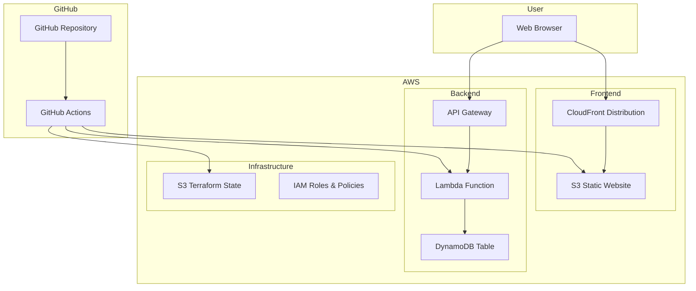

# Design Document

## Overview

AWS Deployment機能は、simple-crud-boardアプリケーションをAWSのサーバーレス環境にデプロイするためのインフラストラクチャとCI/CDパイプラインを提供します。Terraformを使用してインフラストラクチャをコード化し、GitHub Actionsを使用して自動デプロイメントを実現します。

### Architecture Goals
- サーバーレスアーキテクチャによるコスト最適化
- Infrastructure as Code (IaC) による再現可能なデプロイメント
- CI/CDパイプラインによる自動化
- AWS無料枠内での運用

## Architecture

### High-Level Architecture



### Data Flow

1. **Static Content**: CloudFront → S3 → Next.js Static Files
2. **API Requests**: User → API Gateway → Lambda → DynamoDB
3. **Deployment**: GitHub Actions → AWS (S3, Lambda, DynamoDB)

## Components and Interfaces

### 1. Terraform Infrastructure

#### Core Resources
- **S3 Buckets**:
  - Static website hosting bucket
  - Terraform state storage bucket
- **Lambda Function**:
  - Go runtime environment
  - API Gateway integration
  - DynamoDB access permissions
- **DynamoDB Table**:
  - Posts storage with partition key
  - On-demand billing mode
- **API Gateway**:
  - REST API with Lambda proxy integration
  - CORS configuration
- **IAM Roles**:
  - Lambda execution role
  - GitHub Actions deployment role

#### Environment Configuration
```hcl
# terraform/environments/dev/terraform.tfvars
environment = "dev"
project_name = "simple-crud-board"
aws_region = "us-east-1"

# terraform/environments/prod/terraform.tfvars
environment = "prod"
project_name = "simple-crud-board"
aws_region = "us-east-1"
```

### 2. Lambda Function Adaptation

#### Handler Structure
```go
// lambda/main.go
package main

import (
    "context"
    "github.com/aws/aws-lambda-go/events"
    "github.com/aws/aws-lambda-go/lambda"
    "github.com/awslabs/aws-lambda-go-api-proxy/gin"
)

func Handler(ctx context.Context, req events.APIGatewayProxyRequest) (events.APIGatewayProxyResponse, error) {
    // Gin router setup with Lambda adapter
}
```

#### DynamoDB Integration
```go
// internal/database/dynamodb.go
type DynamoDBClient struct {
    client    *dynamodb.Client
    tableName string
}

func (d *DynamoDBClient) CreatePost(post *models.Post) error {
    // DynamoDB PutItem operation
}
```

### 3. Frontend Static Export

#### Next.js Configuration
```javascript
// next.config.js
const nextConfig = {
  output: 'export',
  trailingSlash: true,
  images: {
    unoptimized: true
  },
  env: {
    NEXT_PUBLIC_API_URL: process.env.NEXT_PUBLIC_API_URL
  }
}
```

### 4. GitHub Actions Workflow

#### Workflow Structure
```yaml
# .github/workflows/deploy.yml
name: Deploy to AWS
on:
  push:
    branches: [main, develop]

jobs:
  deploy-infrastructure:
    # Terraform apply
  
  deploy-frontend:
    # Next.js build and S3 upload
  
  deploy-backend:
    # Go build and Lambda deployment
```

## Data Models

### DynamoDB Schema

#### Posts Table
```json
{
  "TableName": "simple-crud-board-posts-{environment}",
  "KeySchema": [
    {
      "AttributeName": "id",
      "KeyType": "HASH"
    }
  ],
  "AttributeDefinitions": [
    {
      "AttributeName": "id",
      "AttributeType": "S"
    }
  ],
  "BillingMode": "PAY_PER_REQUEST"
}
```

#### Post Item Structure
```json
{
  "id": {"S": "uuid-string"},
  "content": {"S": "Post content"},
  "created_at": {"S": "2024-01-01T00:00:00Z"},
  "updated_at": {"S": "2024-01-01T00:00:00Z"}
}
```

### Go Model Adaptation
```go
// models/post.go
type Post struct {
    ID        string    `json:"id" dynamodbav:"id"`
    Content   string    `json:"content" dynamodbav:"content"`
    CreatedAt time.Time `json:"created_at" dynamodbav:"created_at"`
    UpdatedAt time.Time `json:"updated_at" dynamodbav:"updated_at"`
}
```

## Error Handling

### Lambda Error Responses
```go
type ErrorResponse struct {
    Error   string `json:"error"`
    Message string `json:"message"`
    Code    int    `json:"code"`
}

func HandleError(err error) events.APIGatewayProxyResponse {
    return events.APIGatewayProxyResponse{
        StatusCode: 500,
        Headers: map[string]string{
            "Content-Type": "application/json",
            "Access-Control-Allow-Origin": "*",
        },
        Body: `{"error": "Internal Server Error"}`,
    }
}
```

### DynamoDB Error Handling
- **ConditionalCheckFailedException**: Resource not found (404)
- **ValidationException**: Bad request (400)
- **ResourceNotFoundException**: Table not found (500)
- **ThrottlingException**: Rate limiting (429)

### Terraform Error Handling
- State locking with DynamoDB
- Retry mechanisms for AWS API calls
- Rollback strategies for failed deployments

## Testing Strategy

### Unit Tests
```go
// tests/handlers_test.go
func TestCreatePost(t *testing.T) {
    // Mock DynamoDB client
    // Test handler logic
}
```

### Integration Tests
```go
// tests/integration_test.go
func TestLambdaHandler(t *testing.T) {
    // Test complete Lambda handler with mock events
}
```

### Infrastructure Tests
```go
// tests/terraform_test.go
func TestTerraformPlan(t *testing.T) {
    // Terratest for infrastructure validation
}
```

### End-to-End Tests
```yaml
# .github/workflows/e2e-test.yml
- name: Run E2E Tests
  run: |
    # Deploy to test environment
    # Run Cypress tests against deployed application
    # Cleanup test resources
```

## Security Considerations

### IAM Policies
- Principle of least privilege
- Resource-specific permissions
- Time-based access controls

### API Security
- CORS configuration
- Input validation
- Rate limiting via API Gateway

### Data Security
- DynamoDB encryption at rest
- S3 bucket policies
- Lambda environment variable encryption

## Cost Optimization

### AWS Free Tier Limits
- **Lambda**: 1M requests/month, 400,000 GB-seconds
- **DynamoDB**: 25GB storage, 25 RCU/WCU
- **S3**: 5GB storage, 20,000 GET requests
- **API Gateway**: 1M API calls/month

### Resource Configuration
- Lambda: 128MB memory allocation
- DynamoDB: On-demand billing
- S3: Standard storage class
- CloudFront: Optional (can be added later)

## Deployment Strategy

### Environment Promotion
1. **Development**: Feature branches → dev environment
2. **Production**: Main branch → prod environment

### Blue-Green Deployment
- Lambda aliases for traffic shifting
- S3 versioning for rollback capability
- Database migration strategies

### Monitoring and Alerting
- CloudWatch logs and metrics
- AWS X-Ray for distributed tracing
- Cost monitoring and alerts