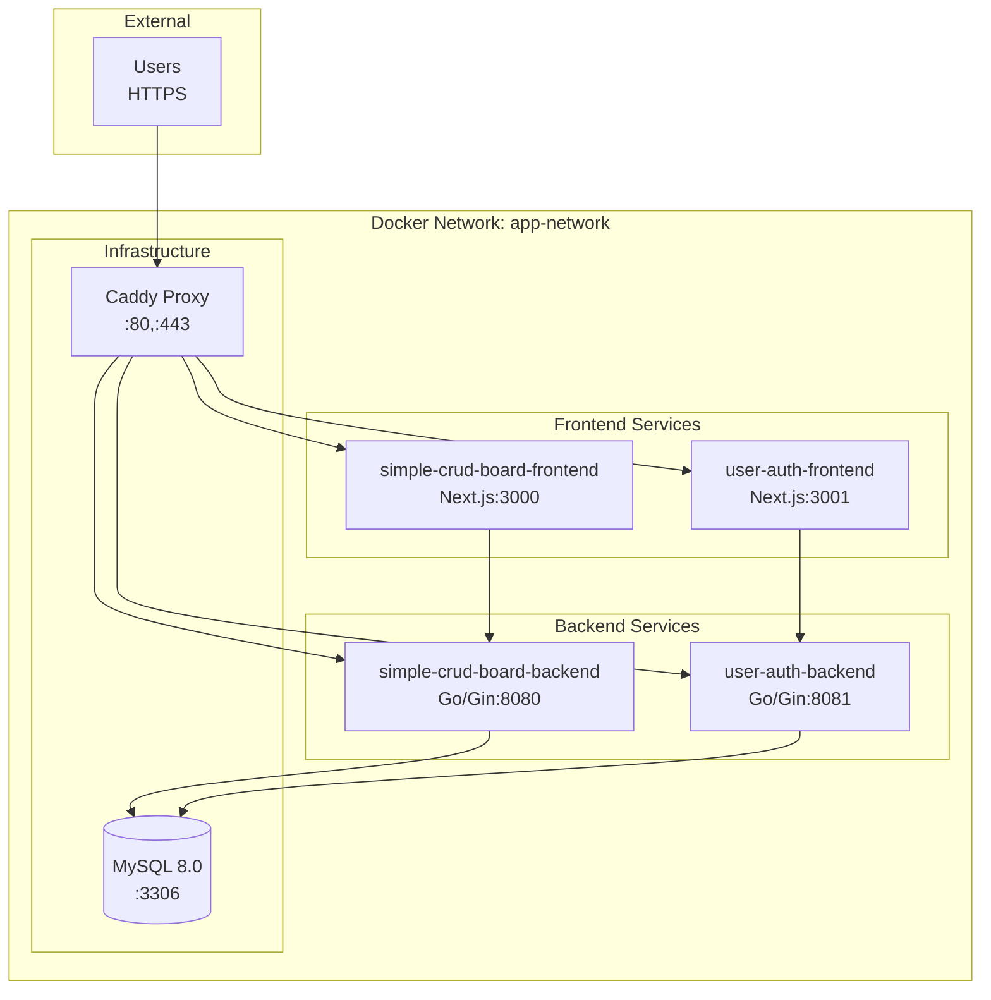
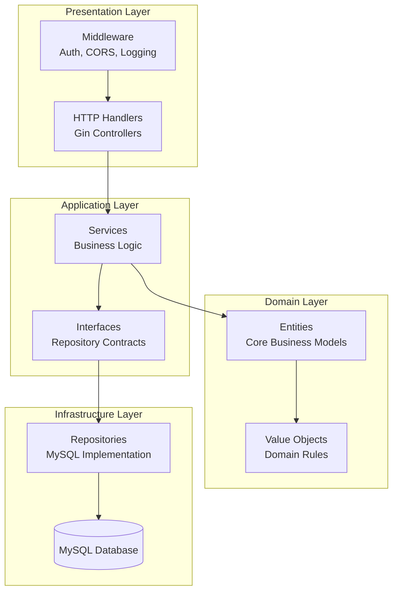

# Design Document

## Overview

このプロジェクトは、既存のsimple-crud-boardとuser-authenticationアプリケーションを統合し、Docker、Makefile、クリーンアーキテクチャを活用した本格的なマイクロサービス環境を構築します。MySQLデータベース、Caddyリバースプロキシ、マルチステージビルド、HTTPS通信を含む完全な開発・本番環境を提供します。

## Architecture

### System Architecture



### Clean Architecture (Go Backend)



### Request Flow

1. **External Request**: User accesses https://app.local
2. **Caddy Proxy**: Routes request to appropriate frontend service
3. **Frontend**: Next.js serves page and makes API calls
4. **Backend**: Go/Gin processes API requests through clean architecture layers
5. **Database**: MySQL stores and retrieves data
6. **Response**: Data flows back through the same path with HTTPS encryption

## Components and Interfaces

### Docker Services Configuration

#### docker-compose.yml Structure
```yaml
version: '3.8'
services:
  # Frontend Services
  simple-crud-frontend:
    build:
      context: ./simple-crud-board/frontend
      dockerfile: Dockerfile.multi
    networks: [app-network]
    
  user-auth-frontend:
    build:
      context: ./user-authentication/frontend
      dockerfile: Dockerfile.multi
    networks: [app-network]
    
  # Backend Services
  simple-crud-backend:
    build:
      context: ./simple-crud-board/backend
      dockerfile: Dockerfile.multi
    environment:
      - DB_HOST=mysql
      - DB_PORT=3306
    depends_on: [mysql]
    networks: [app-network]
    
  user-auth-backend:
    build:
      context: ./user-authentication/backend
      dockerfile: Dockerfile.multi
    environment:
      - DB_HOST=mysql
      - DB_PORT=3306
    depends_on: [mysql]
    networks: [app-network]
    
  # Infrastructure
  caddy:
    image: caddy:2-alpine
    ports: ["80:80", "443:443"]
    volumes: ["./caddy/Caddyfile:/etc/caddy/Caddyfile"]
    networks: [app-network]
    
  mysql:
    image: mysql:8.0
    environment:
      MYSQL_ROOT_PASSWORD: rootpass
      MYSQL_DATABASE: appdb
    volumes: ["mysql_data:/var/lib/mysql"]
    networks: [app-network]

networks:
  app-network:
    driver: bridge

volumes:
  mysql_data:
```

### Makefile Commands

#### Core Commands
```makefile
# Development commands
.PHONY: up down build logs clean

up:           # Start all services
down:         # Stop all services  
build:        # Build all images
logs:         # Show all logs
clean:        # Clean up containers and volumes

# Individual service commands
up-frontend:  # Start frontend services only
up-backend:   # Start backend services only
up-db:        # Start database only

# Development helpers
shell-db:     # Connect to MySQL shell
migrate:      # Run database migrations
test:         # Run all tests
```

### Multi-Stage Dockerfile Templates

#### Frontend Dockerfile (Next.js)
```dockerfile
# Build stage
FROM node:18-alpine AS builder
WORKDIR /app
COPY package*.json ./
RUN npm ci --only=production
COPY . .
RUN npm run build

# Production stage
FROM node:18-alpine AS runner
WORKDIR /app
RUN addgroup --system --gid 1001 nodejs
RUN adduser --system --uid 1001 nextjs
COPY --from=builder /app/public ./public
COPY --from=builder --chown=nextjs:nodejs /app/.next/standalone ./
COPY --from=builder --chown=nextjs:nodejs /app/.next/static ./.next/static
USER nextjs
EXPOSE 3000
CMD ["node", "server.js"]
```

#### Backend Dockerfile (Go)
```dockerfile
# Build stage
FROM golang:1.21-alpine AS builder
WORKDIR /app
COPY go.mod go.sum ./
RUN go mod download
COPY . .
RUN CGO_ENABLED=0 GOOS=linux go build -o main .

# Production stage
FROM alpine:latest AS runner
RUN apk --no-cache add ca-certificates
WORKDIR /root/
COPY --from=builder /app/main .
EXPOSE 8080
CMD ["./main"]
```

### Caddy Configuration

#### Caddyfile
```caddyfile
{
    auto_https off
    local_certs
}

app.local {
    reverse_proxy /api/crud/* simple-crud-backend:8080
    reverse_proxy /api/auth/* user-auth-backend:8081
    reverse_proxy /crud/* simple-crud-frontend:3000
    reverse_proxy /auth/* user-auth-frontend:3001
    reverse_proxy /* simple-crud-frontend:3000
}
```

## Clean Architecture Implementation (Go)

### Domain Layer

#### Entities
```go
// entities/post.go
type Post struct {
    ID        int       `json:"id"`
    Content   string    `json:"content"`
    UserID    int       `json:"user_id"`
    CreatedAt time.Time `json:"created_at"`
    UpdatedAt time.Time `json:"updated_at"`
}

func (p *Post) Validate() error {
    if strings.TrimSpace(p.Content) == "" {
        return errors.New("content cannot be empty")
    }
    return nil
}

// entities/user.go
type User struct {
    ID        int       `json:"id"`
    Email     string    `json:"email"`
    Username  string    `json:"username"`
    Password  string    `json:"-"`
    CreatedAt time.Time `json:"created_at"`
}

func (u *User) ValidateEmail() error {
    // Email validation logic
}
```

### Application Layer

#### Repository Interfaces
```go
// interfaces/post_repository.go
type PostRepository interface {
    Create(ctx context.Context, post *entities.Post) error
    GetByID(ctx context.Context, id int) (*entities.Post, error)
    GetByUserID(ctx context.Context, userID int) ([]*entities.Post, error)
    Update(ctx context.Context, post *entities.Post) error
    Delete(ctx context.Context, id int) error
}

// interfaces/user_repository.go
type UserRepository interface {
    Create(ctx context.Context, user *entities.User) error
    GetByEmail(ctx context.Context, email string) (*entities.User, error)
    GetByID(ctx context.Context, id int) (*entities.User, error)
}
```

#### Services
```go
// services/post_service.go
type PostService struct {
    postRepo interfaces.PostRepository
    userRepo interfaces.UserRepository
}

func NewPostService(postRepo interfaces.PostRepository, userRepo interfaces.UserRepository) *PostService {
    return &PostService{
        postRepo: postRepo,
        userRepo: userRepo,
    }
}

func (s *PostService) CreatePost(ctx context.Context, userID int, content string) (*entities.Post, error) {
    // Business logic for creating posts
}

func (s *PostService) GetUserPosts(ctx context.Context, userID int) ([]*entities.Post, error) {
    // Business logic for retrieving user posts
}
```

### Infrastructure Layer

#### Repository Implementation
```go
// repositories/mysql_post_repository.go
type MySQLPostRepository struct {
    db *sql.DB
}

func NewMySQLPostRepository(db *sql.DB) *MySQLPostRepository {
    return &MySQLPostRepository{db: db}
}

func (r *MySQLPostRepository) Create(ctx context.Context, post *entities.Post) error {
    query := `INSERT INTO posts (content, user_id, created_at, updated_at) VALUES (?, ?, ?, ?)`
    // Implementation
}
```

### Presentation Layer

#### HTTP Handlers
```go
// handlers/post_handler.go
type PostHandler struct {
    postService *services.PostService
}

func NewPostHandler(postService *services.PostService) *PostHandler {
    return &PostHandler{postService: postService}
}

func (h *PostHandler) CreatePost(c *gin.Context) {
    // HTTP handling logic
}
```

#### Dependency Injection
```go
// main.go
func main() {
    // Database connection
    db := setupDatabase()
    
    // Repository layer
    postRepo := repositories.NewMySQLPostRepository(db)
    userRepo := repositories.NewMySQLUserRepository(db)
    
    // Service layer
    postService := services.NewPostService(postRepo, userRepo)
    userService := services.NewUserService(userRepo)
    
    // Handler layer
    postHandler := handlers.NewPostHandler(postService)
    userHandler := handlers.NewUserHandler(userService)
    
    // Router setup
    router := setupRouter(postHandler, userHandler)
    router.Run(":8080")
}
```

## Data Models

### MySQL Database Schema

#### Users Table
```sql
CREATE TABLE users (
    id INT AUTO_INCREMENT PRIMARY KEY,
    email VARCHAR(255) UNIQUE NOT NULL,
    username VARCHAR(100) NOT NULL,
    password_hash VARCHAR(255) NOT NULL,
    created_at TIMESTAMP DEFAULT CURRENT_TIMESTAMP,
    updated_at TIMESTAMP DEFAULT CURRENT_TIMESTAMP ON UPDATE CURRENT_TIMESTAMP,
    INDEX idx_email (email)
);
```

#### Posts Table
```sql
CREATE TABLE posts (
    id INT AUTO_INCREMENT PRIMARY KEY,
    content TEXT NOT NULL,
    user_id INT NOT NULL,
    created_at TIMESTAMP DEFAULT CURRENT_TIMESTAMP,
    updated_at TIMESTAMP DEFAULT CURRENT_TIMESTAMP ON UPDATE CURRENT_TIMESTAMP,
    FOREIGN KEY (user_id) REFERENCES users(id) ON DELETE CASCADE,
    INDEX idx_user_id (user_id),
    INDEX idx_created_at (created_at)
);
```

#### Sessions Table
```sql
CREATE TABLE sessions (
    id VARCHAR(255) PRIMARY KEY,
    user_id INT NOT NULL,
    expires_at TIMESTAMP NOT NULL,
    created_at TIMESTAMP DEFAULT CURRENT_TIMESTAMP,
    FOREIGN KEY (user_id) REFERENCES users(id) ON DELETE CASCADE,
    INDEX idx_user_id (user_id),
    INDEX idx_expires_at (expires_at)
);
```

### Migration System
```go
// migrations/migration.go
type Migration struct {
    Version     int
    Description string
    Up          func(*sql.DB) error
    Down        func(*sql.DB) error
}

var migrations = []Migration{
    {
        Version:     1,
        Description: "Create users table",
        Up:          createUsersTable,
        Down:        dropUsersTable,
    },
    // Additional migrations...
}
```

## Error Handling

### Structured Error Response
```go
type APIError struct {
    Code    int    `json:"code"`
    Message string `json:"message"`
    Details string `json:"details,omitempty"`
}

// Error types
var (
    ErrNotFound      = &APIError{Code: 404, Message: "Resource not found"}
    ErrUnauthorized  = &APIError{Code: 401, Message: "Unauthorized"}
    ErrForbidden     = &APIError{Code: 403, Message: "Forbidden"}
    ErrBadRequest    = &APIError{Code: 400, Message: "Bad request"}
    ErrInternalError = &APIError{Code: 500, Message: "Internal server error"}
)
```

### Middleware Error Handling
```go
func ErrorHandlerMiddleware() gin.HandlerFunc {
    return func(c *gin.Context) {
        c.Next()
        
        if len(c.Errors) > 0 {
            err := c.Errors.Last()
            // Handle different error types
        }
    }
}
```

## Testing Strategy

### Unit Testing
- **Domain Layer**: Entity validation and business rules
- **Service Layer**: Business logic with mocked repositories
- **Repository Layer**: Database operations with test database
- **Handler Layer**: HTTP request/response handling

### Integration Testing
- **API Testing**: End-to-end API functionality
- **Database Testing**: Real database operations
- **Service Integration**: Cross-service communication

### Docker Testing
- **Container Health Checks**: Verify service availability
- **Network Testing**: Inter-service communication
- **Volume Persistence**: Data persistence verification

## Security Considerations

### HTTPS/TLS
- Caddy automatic HTTPS with local certificates
- Secure cookie attributes (HttpOnly, Secure, SameSite)
- HSTS headers for enhanced security

### Database Security
- Connection encryption
- Prepared statements to prevent SQL injection
- Database user with minimal privileges

### Container Security
- Non-root user in production containers
- Minimal base images (Alpine Linux)
- Security scanning in CI/CD pipeline

## Performance Optimization

### Docker Optimization
- Multi-stage builds for smaller images
- Layer caching optimization
- Resource limits and health checks

### Database Optimization
- Proper indexing strategy
- Connection pooling
- Query optimization

### Caching Strategy
- Static asset caching in Caddy
- Database query result caching
- Session caching for authentication

## Development Workflow

### Local Development Setup
1. Clone repository
2. Run `make up` to start all services
3. Access application at https://app.local
4. Use `make logs` to monitor services

### Database Management
1. Run `make migrate` to apply database migrations
2. Use `make shell-db` to access MySQL shell
3. Backup/restore procedures for data management

### Testing Workflow
1. Run `make test` for comprehensive testing
2. Individual service testing with `make test-backend`
3. Integration testing with full stack

This design provides a comprehensive foundation for building a production-ready microservices environment with modern DevOps practices and clean architecture principles.