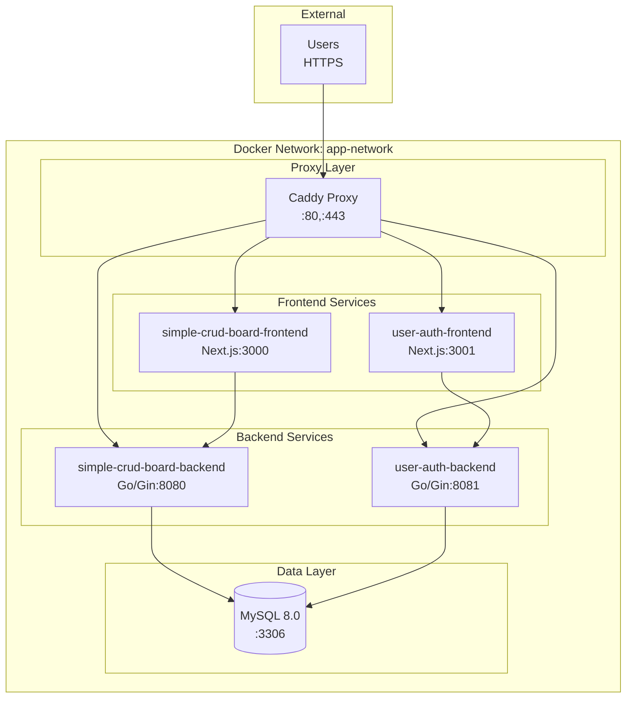
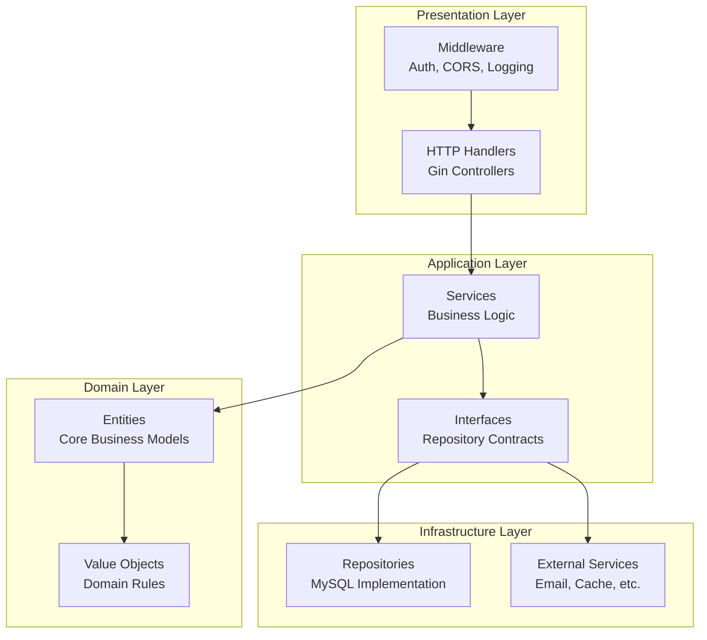
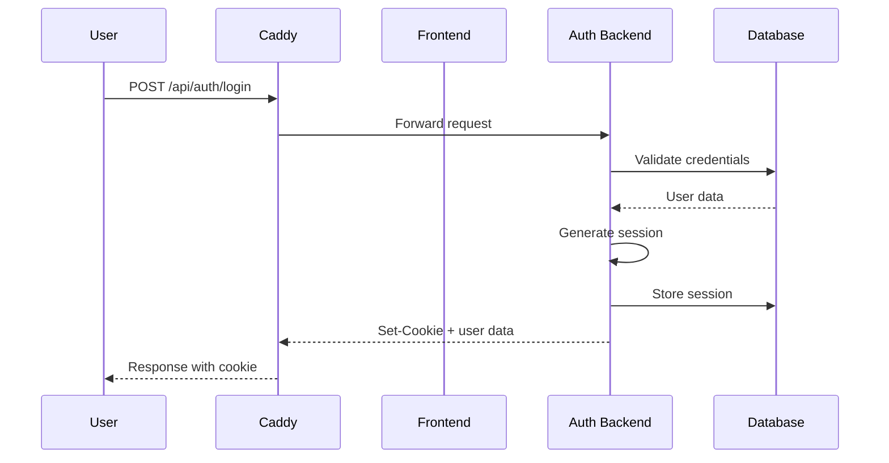

# Docker Orchestration アーキテクチャ設計書

## 概要

このドキュメントでは、Docker Orchestrationプロジェクトのアーキテクチャ設計について詳しく説明します。

## システムアーキテクチャ

### 全体構成



### レイヤー構成

1. **Proxy Layer**: CaddyによるリバースプロキシとHTTPS終端
2. **Frontend Layer**: Next.jsによるユーザーインターフェース
3. **Backend Layer**: GoによるビジネスロジックとAPI
4. **Data Layer**: MySQLによるデータ永続化

## クリーンアーキテクチャ (Go Backend)

### 層構成



### 依存関係の方向

- **上位層 → 下位層**: 直接依存
- **下位層 → 上位層**: インターフェースを通じた依存性逆転

## ディレクトリ構造

### プロジェクト全体

```
docker-orchestration/
├── README.md                    # プロジェクト概要
├── Makefile                     # 開発ワークフロー自動化
├── docker-compose.yml           # サービス統合設定
├── .env.example                 # 環境変数設定例
├── caddy/
│   └── Caddyfile               # リバースプロキシ設定
├── database/
│   ├── init/                   # データベース初期化
│   └── migrations/             # マイグレーションファイル
├── simple-crud-board/          # CRUD掲示板アプリ
├── user-authentication/        # ユーザー認証アプリ
└── docs/                       # ドキュメント
```

### Go Backend構造 (クリーンアーキテクチャ)

```
backend/
├── cmd/
│   └── server/
│       └── main.go             # アプリケーションエントリーポイント
├── internal/
│   ├── domain/                 # Domain Layer
│   │   ├── entities/           # エンティティ
│   │   └── valueobjects/       # 値オブジェクト
│   ├── application/            # Application Layer
│   │   ├── services/           # アプリケーションサービス
│   │   └── interfaces/         # リポジトリインターフェース
│   ├── infrastructure/         # Infrastructure Layer
│   │   ├── repositories/       # データベースリポジトリ
│   │   ├── database/           # データベース接続
│   │   └── external/           # 外部サービス
│   └── presentation/           # Presentation Layer
│       ├── handlers/           # HTTPハンドラー
│       ├── middleware/         # ミドルウェア
│       └── routes/             # ルーティング
├── pkg/                        # 共通パッケージ
├── configs/                    # 設定ファイル
└── Dockerfile.multi            # マルチステージDockerfile
```

## データフロー

### リクエストフロー

1. **外部リクエスト**: ユーザーがhttps://app.localにアクセス
2. **プロキシ処理**: Caddyがリクエストを受信し、適切なサービスにルーティング
3. **フロントエンド処理**: Next.jsがページを提供し、APIコールを実行
4. **バックエンド処理**: GoがAPIリクエストを処理
5. **データベースアクセス**: MySQLからデータを取得・更新
6. **レスポンス**: 逆順でレスポンスを返却

### 認証フロー



## ネットワーク設計

### Docker Network

- **ネットワーク名**: `docker-orchestration-network`
- **サブネット**: `172.20.0.0/16`
- **ドライバー**: `bridge`

### ポート設定

| サービス | 内部ポート | 外部ポート | 説明 |
|---------|-----------|-----------|------|
| Caddy | 80, 443 | 80, 443 | HTTP/HTTPS |
| MySQL | 3306 | 3306 | データベース |
| simple-crud-frontend | 3000 | - | 内部通信のみ |
| user-auth-frontend | 3001 | - | 内部通信のみ |
| simple-crud-backend | 8080 | - | 内部通信のみ |
| user-auth-backend | 8081 | - | 内部通信のみ |

## セキュリティ設計

### HTTPS/TLS

- **証明書管理**: Caddy自動証明書
- **プロトコル**: TLS 1.2以上
- **暗号化**: 強力な暗号スイート

### 認証・認可

- **認証方式**: Cookie-based Session
- **セッション管理**: データベース保存
- **パスワード**: bcryptハッシュ化

### コンテナセキュリティ

- **非rootユーザー**: 全コンテナで非rootユーザー実行
- **最小権限**: 必要最小限の権限のみ付与
- **イメージスキャン**: 脆弱性スキャンの実施

## パフォーマンス設計

### データベース最適化

- **接続プール**: 最大25接続、アイドル5接続
- **インデックス**: 適切なインデックス設計
- **クエリ最適化**: スロークエリの監視

### キャッシュ戦略

- **静的ファイル**: Caddyでのキャッシュ
- **API レスポンス**: 適切なCache-Controlヘッダー
- **データベース**: クエリ結果のキャッシュ

### リソース制限

```yaml
deploy:
  resources:
    limits:
      memory: 512M
      cpus: '0.5'
    reservations:
      memory: 256M
      cpus: '0.25'
```

## 監視・ログ設計

### ヘルスチェック

- **エンドポイント**: `/health`
- **チェック間隔**: 30秒
- **タイムアウト**: 10秒
- **リトライ**: 3回

### ログ管理

- **アプリケーションログ**: 構造化ログ (JSON)
- **アクセスログ**: Caddyアクセスログ
- **エラーログ**: 集約エラーログ

### メトリクス

- **システムメトリクス**: CPU、メモリ、ディスク使用量
- **アプリケーションメトリクス**: レスポンス時間、エラー率
- **ビジネスメトリクス**: ユーザー数、投稿数

## 拡張性設計

### 水平スケーリング

- **ロードバランサー**: Caddyによる負荷分散
- **ステートレス設計**: セッション情報のデータベース保存
- **データベース**: レプリケーション対応

### マイクロサービス化

- **サービス分離**: 機能別のサービス分割
- **API Gateway**: Caddyによる統一エンドポイント
- **サービス間通信**: HTTP REST API

## 開発・運用設計

### 開発環境

- **ホットリロード**: 開発時の自動リロード
- **デバッグ**: 適切なログレベル設定
- **テスト**: 単体・統合・E2Eテスト

### CI/CD

- **ビルド**: 自動ビルドとテスト
- **デプロイ**: 段階的デプロイメント
- **ロールバック**: 迅速なロールバック機能

### バックアップ・復旧

- **データベース**: 定期的なバックアップ
- **設定ファイル**: バージョン管理
- **災害復旧**: RTO/RPO設定

## 技術選定理由

### Docker

- **コンテナ化**: 環境の一貫性
- **ポータビリティ**: 異なる環境での実行
- **スケーラビリティ**: 容易なスケーリング

### Caddy

- **自動HTTPS**: 証明書の自動管理
- **設定の簡潔性**: 直感的な設定
- **パフォーマンス**: 高性能なプロキシ

### MySQL

- **信頼性**: 実績のあるデータベース
- **パフォーマンス**: 高速なクエリ処理
- **機能**: 豊富な機能セット

### Go

- **パフォーマンス**: 高速な実行
- **並行性**: Goroutineによる並行処理
- **型安全性**: 静的型付けによる安全性

### Next.js

- **SSR/SSG**: サーバーサイドレンダリング
- **パフォーマンス**: 最適化された出力
- **開発体験**: 優れた開発者体験